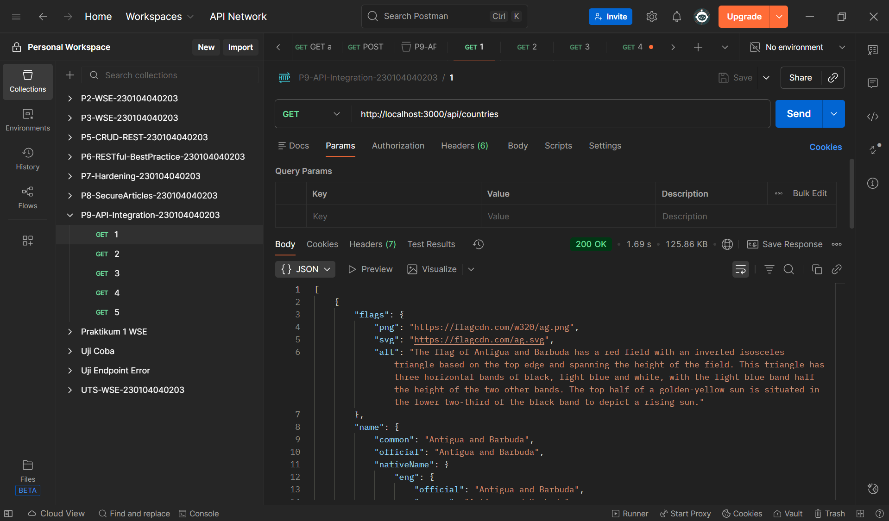
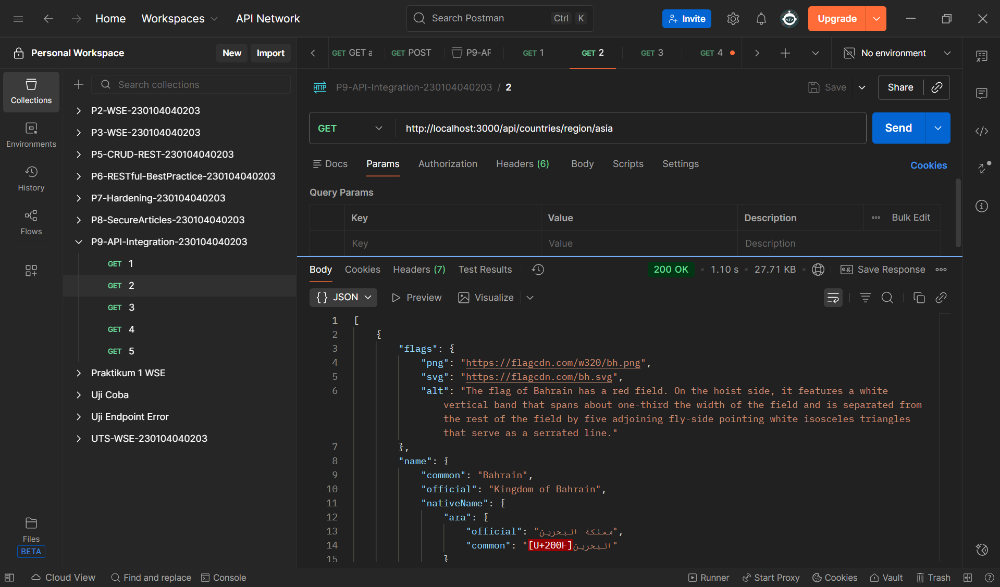
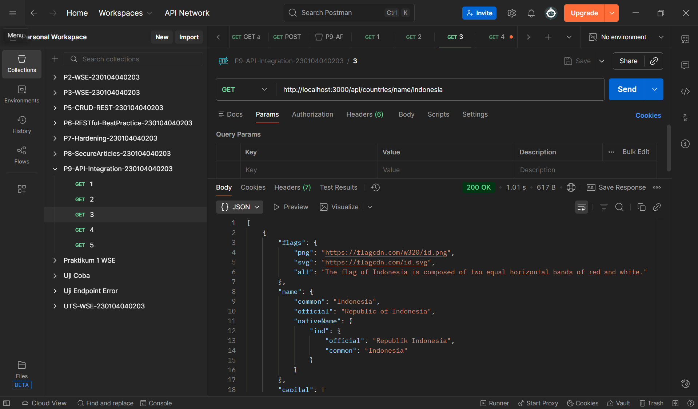
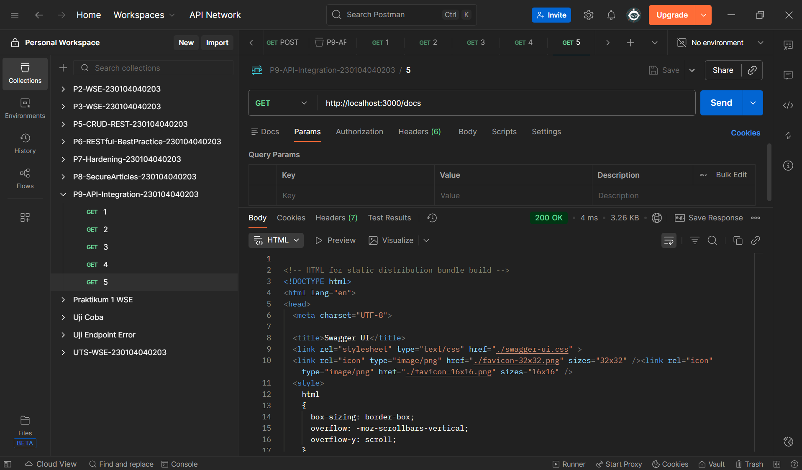

# Praktikum 9 — Web Service Engineering  
**Topik:** Integrasi API Eksternal (Node.js Modular Architecture)  
**Dosen:** Muhayat, M.IT  

---

## 📌 Deskripsi  
Praktikum ini membangun backend Node.js dengan arsitektur modular yang mengintegrasikan:

- REST Countries API  
- OpenWeatherMap API  

Fitur yang diimplementasikan:

- Struktur modular (routes, controllers, services, middleware, utils)
- Caching menggunakan NodeCache
- Logging menggunakan Morgan
- Error handling global
- Dokumentasi API dengan Swagger UI

---

## 🎯 Tujuan
- Memahami arsitektur modular Node.js  
- Mengintegrasikan API eksternal  
- Menerapkan caching  
- Menerapkan logging & error handling  
- Membuat dokumentasi dengan Swagger  
- Menguji endpoint melalui Postman / browser  

---

## 🧰 Tools
- Node.js LTS  
- Express.js  
- Axios  
- NodeCache  
- Morgan  
- Swagger UI Express  
- Dotenv  

---

## 🗂 Struktur Project

```

--- 

P9-API-INTEGRATION-230104040203/
│
├── node_modules/
│
├── src/
│ ├── controllers/
│ │ ├── countries.controller.js
│ │ └── weather.controller.js
│ │
│ ├── docs/
│ │ └── openapi.js
│ │
│ ├── foto/
│ │ ├── 1. Semua negara.png
│ │ ├── 2. Region Asia.png
│ │ ├── 3. Negara Indonesia.png
│ │ ├── 4. Cuaca kota (opsional).png
│ │ └── 5. Swagger UI.png
│ │
│ ├── middleware/
│ │ ├── error.middleware.js
│ │ └── notfound.middleware.js
│ │
│ ├── routes/
│ │ ├── countries.routes.js
│ │ └── weather.routes.js
│ │
│ ├── services/
│ │ ├── countries.service.js
│ │ └── weather.service.js
│ │
│ └── utils/
│ ├── cache.js
│ └── httpClient.js
│
├── .env
├── package-lock.json
├── package.json
├── README.md
└── server.js

---
```

---

## ⚙️ Instalasi

### 1. Install dependency
```npm install```


### 2. Buat file `.env`
```OWM_API_KEY=YOUR_OPENWEATHERMAP_API_KEY```


Dapatkan API key dari: https://openweathermap.org/api

---

## ▶️ Menjalankan Server
```npm start```


Server berjalan di:
```http://localhost:3000/```


---

## 🔗 Endpoint API
```
### 🌎 Countries API
| Endpoint | Deskripsi |
|----------|-----------|
| `/api/countries` | Semua negara |
| `/api/countries/region/:region` | Negara berdasarkan region |
| `/api/countries/name/:name` | Cari negara berdasarkan nama |

---

```

---
```
### 🌤 Weather API
| Endpoint | Deskripsi |
|----------|-----------|
| `/api/weather?city=Palangkaraya` | Cuaca berdasarkan nama kota |
```
---

### 📘 Swagger Documentation
```http://localhost:3000/docs```

## 🧪 Uji Coba Endpoint

Jalankan server:
```npm start```


---

## 📌 Tabel Pengujian Endpoint (dengan gambar hasil Postman)

| No | Endpoint | Deskripsi | Contoh URL | Hasil (Screenshot Postman) |
|----|----------|-----------|------------|-----------------------------|
| 1 | GET /api/countries | Menampilkan semua negara | `http://localhost:3000/api/countries` |  |
| 2 | GET /api/countries/region/:region | Menampilkan negara berdasarkan region | `http://localhost:3000/api/countries/region/asia` |  |
| 3 | GET /api/countries/name/:name | Menampilkan detail negara berdasarkan nama | `http://localhost:3000/api/countries/name/indonesia` |  |
| 4 | GET /api/weather?city=Palangkaraya | Menampilkan cuaca kota (opsional) | `http://localhost:3000/api/weather?city=Palangkaraya` | .png) |
| 5 | GET /docs | Dokumentasi API Swagger UI | `http://localhost:3000/docs` |  |

---

## 📜 Kesimpulan Uji Coba

```
Semua endpoint:

✔ Berjalan dengan **status 200**  
✔ Mengembalikan data yang sesuai  
✔ Caching bekerja (respons lebih cepat pada request kedua)  
✔ Ditampilkan dengan benar di Postman  
✔ Terdokumentasi melalui Swagger UI  

```
---


---
```
## 🧪 Checklist Pengujian
- [x] Struktur modular berjalan  
- [x] Morgan logging aktif  
- [x] Caching aktif (request kedua lebih cepat)  
- [x] Error handler tampil rapi  
- [x] Swagger UI berjalan  
- [x] Semua endpoint mengembalikan status 200  
```
---

## ❗ Troubleshooting

### Error: `EADDRINUSE: port 3000 sudah dipakai`

Artinya ada aplikasi lain memakai port 3000.

#### 1️⃣ Cek PID pengguna port 3000:
```netstat -ano | findstr :3000```


#### 2️⃣ Hentikan prosesnya:
```taskkill /PID <PID> /F```

Contoh:
```taskkill /PID 3258 /F```

#### 3️⃣ Jalankan ulang server:
```npm start```


---

## 📌 Penilaian
| Komponen | Bobot |
|----------|-------|
| Struktur modular | 20 |
| REST Countries API | 20 |
| OpenWeatherMap API | 15 |
| Caching | 15 |
| Logging & Error Handling | 10 |
| Swagger UI | 10 |
| Kerapian kode & README | 10 |

---

## ✔️ Selesai  
Project backend siap dijalankan dan diuji!
